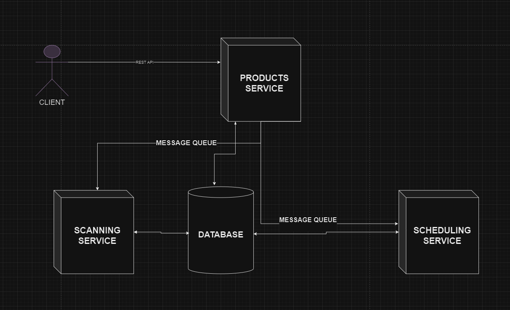

# Domain Scanning Service Backend

## A backend service for managing domain scans and scheduling.
## Built using NestJS, PrismaORM, RabbitMQ, and SQLite.

### Features:
- REST API for requesting domain scans, scan schedules, and viewing scan results.
- Asynchronous processing using RabbitMQ for decoupled services.
- Scheduled scans using cron expressions.
- SQLite database for storing domain information, scan results, and cron records.

### Installation:
1. Clone the repository.
2. In the repo's root directory run `docker-compose -f docker-compose.dev.yml -f docker-compose.rabbit.yml up` to start the backend service, RabbitMQ server, and SQLite database.
4. You can send REST requests to the backend service at `http://localhost:3000`.

### Dev Installation:
For hot reloading run outside of docker:
1. Clone the repository.
2. Run `npm install` to install dependencies.
3. Run `npx prisma migrate dev` to create the SQLite database.
4. Run `npx prisma generate` to generate the Prisma client.
5. Run `npm run start:dev` to start the backend service in development mode.
6. Run `docker-compose -f docker-compose.rabbit.yml up` to start the RabbitMQ server.

#### API Endpoints:
- GET `/domain`: Get a specific domain scan result. If the domain is not found, a new scan, and cron schedule is initiated.
    -- query: domain: string (required) - The domain to scan.
    -- query: interval: number (optional) - The cron interval in times per day. Default is 1.

- POST `/domain`: Create a new domain scan request.
    -- query: domain: string (required) - The domain to scan.
    -- query: interval: number (optional) - The cron interval in times per day. Default is 1.

- Example:
    curl --location 'http://localhost:3000/domain?domain=https%3A%2F%2Fwww.facebook.com&interval=2'

# Services:

## Products Service (API Gateway):

### Responsibilities:
Handles incoming API requests related to domain scan requests.
Validates input data and performs initial processing.
Initiates scan, and cron requests by sending messages to the message queue.
Saves domain information in the database.

### Communication:
Receives API requests from external clients (e.g., web interface, other systems).
Publishes messages to the message queue to trigger scans.
Interacts with the database.

## Scanning Service (Worker):

### Responsibilities:
Consumes messages from the message queue indicating new scan requests.
Performs domain scans using external APIs or tools.
Analyzes scan results and extracts relevant information.
Stores scan results in the database.

### Communication:
Subscribes to the message queue to receive scan requests.
Interacts with the database to store scan results.

## Scheduling Service:

### Responsibilities:
Manages the scheduling of automatic domain scans (cron).
Triggers scan requests by publishing messages to the message queue.

### Communication:
Subscribes to the message queue to receive schedule creation requests.
Publishes messages to the message queue to initiate scheduled scans.

# Communication Channels:

## Message Queue (RabbitMQ):

Primary channel for asynchronous communication between services.
Used to decouple services and ensure reliable message delivery.
The domain-service publishes messages to request scans, and schedules, and the scanning-service, and schedule-service consume these messages to process them.

## REST API:

Used for external clients to interact with the domain-service and initiate domain management operations.

## Database:

### Responsibilities:
Provides a data access layer (ORM) for other services to interact with the database.
Acts as a shared data store for all services.
Provides a central repository for domain information, scan results, and other data.

### Communication:
Each service interacts with the database to store and retrieve data.

# Visual Representation:

All services (Products, Scanning, and Scheduling) interact with the Database directly.

